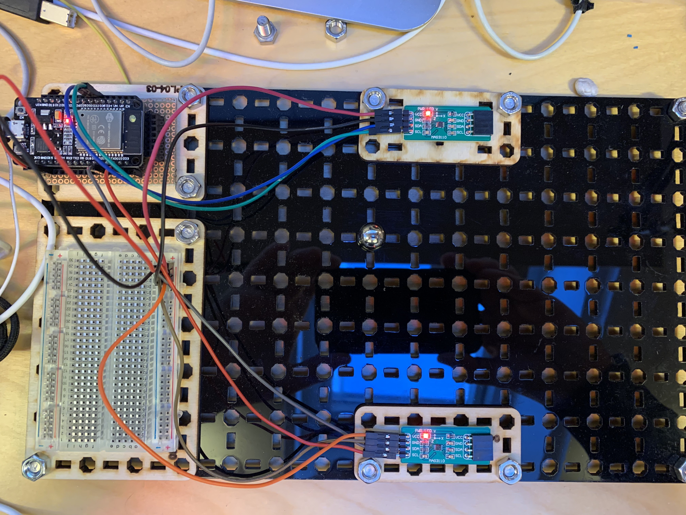
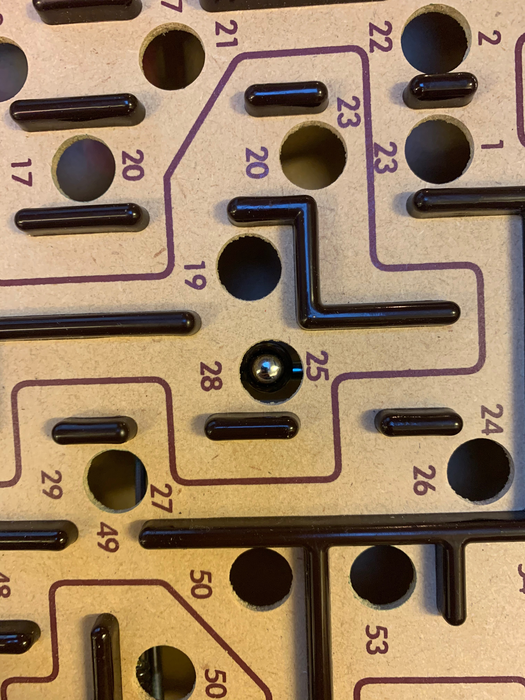

## Hypotese

Det er mulig å detektere posisjonen til en ball ved å

1. hente sensordata fra magnetsensorer som gir tre verdier hver (x,y,z)
2. sende data inn i nevralt nettverk og lære posisjoner gitt inputdata 

## Utstyr

* ESP32
* 2 x MAG3110
* magnetisk kule

## Eksperiment

(3.3V og GND er utelatt fra figuren)

(Breadboard brukes kun til å fordele 3.3V og GND)

## Resultat

**Delvis vellykket**

* Se video: [Video](./doc/demo.mp4)

Det store problemet, var at ballen festet seg i labyrinten fordi den er en sterk magnet,
og spillet har flere metalldeler. Bildet viser at ballen har
festet seg i en av metallstengene inne i spillet:

I dette tilfellet satt ballen så godt fast at man måtte bruke en annen magnet
for å få den ut.

