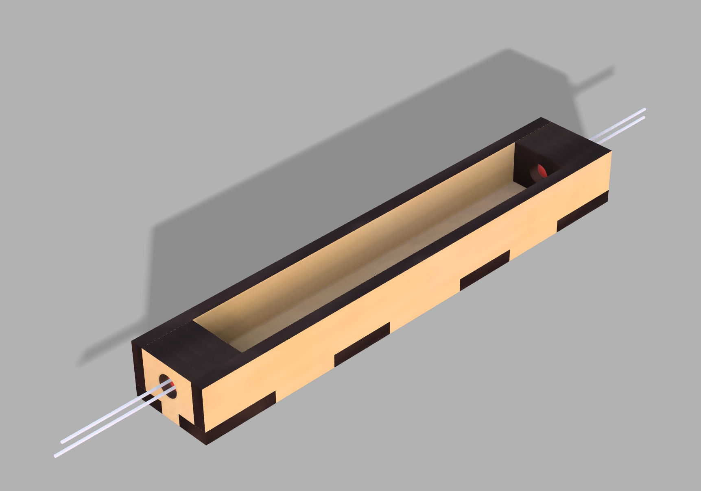
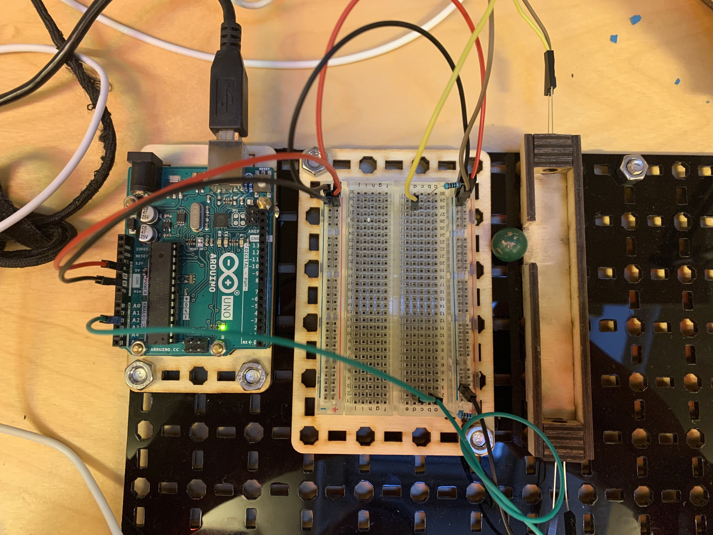

## Hypotese

* Det er mulig å detektere en ball ved hjelp av IR sender og mottaker montert i selve albyrinten

## Utstyr

* Arduino
* IR-holder
* fototransistor: [Kjell](https://www.kjell.com/no/produkter/elektro-og-verktoy/elektronikk/optokomponenter/ir-dioder-fototransistorer/luxorparts-ir-pakke-10-deler-p89281)
* IR-diode: [Kjell](https://www.kjell.com/no/produkter/elektro-og-verktoy/elektronikk/optokomponenter/ir-dioder-fototransistorer/luxorparts-ir-pakke-10-deler-p89281)

Denne IR-holderen ble konstruert:

3D-modeller til IR-holdere ligger her: [things](./things/)

## Eksperiment

Se oppkobling på [denne siden][http://startrobotics.blogspot.com/2013/05/how-to-use-ir-led-and-photodiode-with-arduino.html].

 

## Resultat

**Vellykket** 

* Se video: [Video](./doc/IRBallDetectorTest.mp4) 

