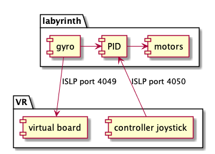

## Labyrinth firmware

## Communication

The microcontroller will save wifi settings.
When reset, the microcontroller will try to connect to 

## Communication

All realtime communication use protobuf protocol on UDP.

